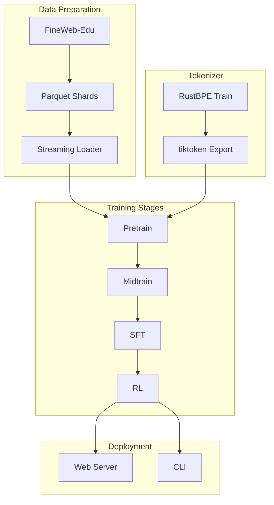
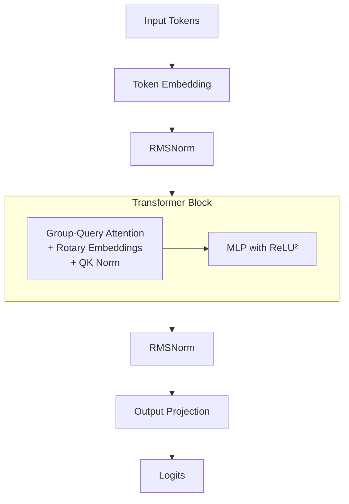
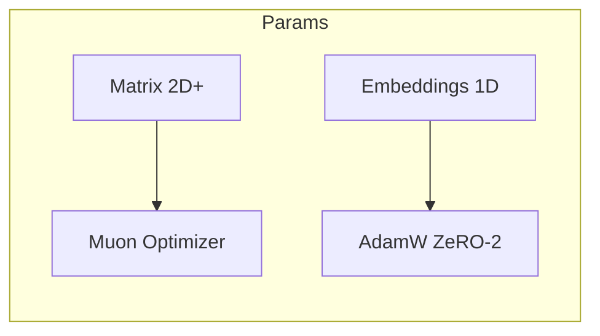
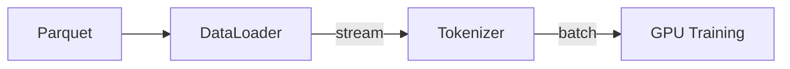

# Architecture

## Training Pipeline

## Model Architecture

## Key Design Choices

| Feature | Choice | Rationale |
|---------|--------|-----------|
| Position | Rotary embeddings | More efficient |
| Attention | Group-Query | Less KV cache memory |
| Activation | ReLU² | Better empirically |
| Norm | RMSNorm | Simpler, no params |
| Weights | Untied | Better performance |

## Optimization

## Data Flow

## Distributed Training

- ZeRO-2 sharded optimizer states
- DDP-aware data loading
- Gradient accumulation
- All-reduce synchronization
