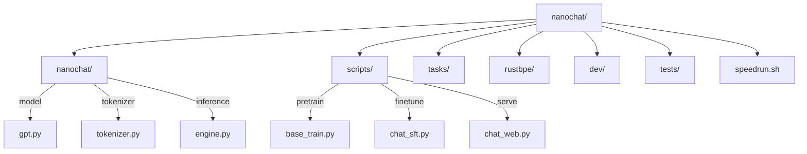

# Repository Structure



## Directory Layout

```
nanochat/
├── nanochat/              # Core Python package
│   ├── gpt.py             # GPT transformer model
│   ├── tokenizer.py       # BPE tokenizer wrapper
│   ├── engine.py          # Inference engine with KV cache
│   ├── dataloader.py      # Distributed data loading
│   ├── dataset.py         # Dataset downloading
│   ├── checkpoint_manager.py
│   ├── adamw.py           # Distributed AdamW
│   ├── muon.py            # Muon optimizer
│   ├── loss_eval.py       # BPB evaluation
│   ├── core_eval.py       # CORE benchmark
│   ├── execution.py       # Python tool execution
│   ├── common.py          # Utilities
│   ├── configurator.py    # CLI parsing
│   ├── report.py          # Report generation
│   └── ui.html            # Web interface
│
├── scripts/               # Training/eval scripts
│   ├── tok_*.py           # Tokenizer scripts
│   ├── base_*.py          # Pretraining scripts
│   ├── mid_train.py       # Midtraining
│   └── chat_*.py          # Chat model scripts
│
├── tasks/                 # Evaluation tasks
│   ├── mmlu.py, arc.py, gsm8k.py
│   └── humaneval.py, smoltalk.py
│
├── rustbpe/               # Rust tokenizer
├── dev/                   # Dev utilities
├── tests/                 # Unit tests
├── speedrun.sh            # $100 pipeline
└── run1000.sh             # $800 pipeline
```

## Key Entry Points

| File | Purpose |
|------|---------|
| `speedrun.sh` | Full training pipeline |
| `nanochat/gpt.py` | Core transformer |
| `scripts/base_train.py` | Pretraining loop |
| `scripts/chat_web.py` | Web server |
