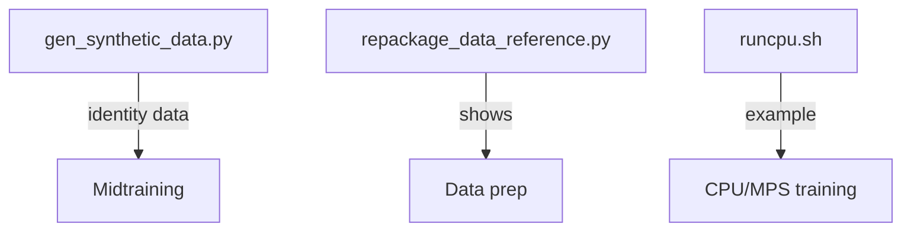

# dev/ - Development Utilities

Helper scripts for development and experimentation.

## Files



| File | Purpose |
|------|---------|
| `gen_synthetic_data.py` | Generate identity conversations |
| `repackage_data_reference.py` | Data preparation reference |
| `runcpu.sh` | CPU/MPS training example |

## Synthetic Data

Customize model personality by mixing synthetic identity data:

```python
# Output format
{
    "messages": [
        {"role": "user", "content": "Who are you?"},
        {"role": "assistant", "content": "I am nanochat..."}
    ]
}
```

## CPU/MPS Training

`runcpu.sh` shows how to train smaller models on:
- Apple Silicon (MPS)
- CPU-only systems
- Memory-limited hardware
