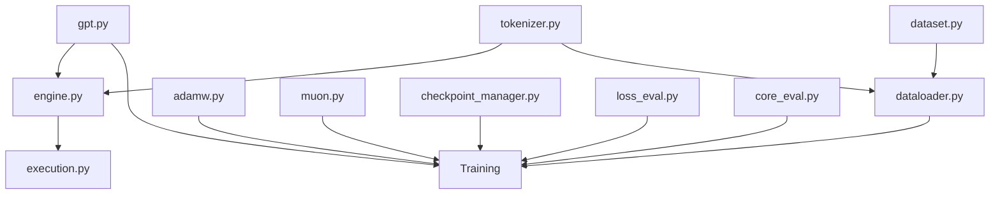

# nanochat/ - Core Package

Core Python package: model, tokenizer, training infrastructure, inference engine.

## Module Dependencies



## Files

| File | Description |
|------|-------------|
| `gpt.py` | GPT transformer with GQA, rotary, RMSNorm |
| `tokenizer.py` | BPE wrapper (RustBPE + tiktoken) |
| `engine.py` | Inference with KV cache + tools |
| `dataloader.py` | Distributed streaming loader |
| `dataset.py` | FineWeb-Edu download |
| `checkpoint_manager.py` | Model checkpointing |
| `adamw.py` | Distributed AdamW (ZeRO-2) |
| `muon.py` | Muon optimizer |
| `loss_eval.py` | Bits-per-byte metric |
| `core_eval.py` | CORE benchmark eval |
| `execution.py` | Sandboxed Python execution |
| `common.py` | Utilities, DDP, logging |
| `configurator.py` | CLI argument parsing |
| `report.py` | Training reports |
| `ui.html` | Web chat interface |

## Key Classes

```python
# Model
GPTConfig(sequence_len, vocab_size, n_layer, n_head, n_kv_head, n_embd)
GPT(config)

# Tokenizer
Tokenizer(model_path)
tokenizer.encode(text) / tokenizer.decode(ids)

# Inference
Engine(model, tokenizer)
engine.generate(prefix, max_tokens)
```

## Special Tokens

| Token | Purpose |
|-------|---------|
| `<\|bos\|>` | Beginning of sequence |
| `<\|user_start/end\|>` | User turn |
| `<\|assistant_start/end\|>` | Assistant turn |
| `<\|python_start/end\|>` | Tool use |
