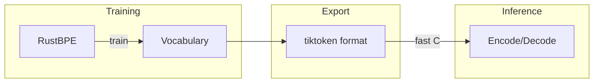

# rustbpe/ - Rust BPE Tokenizer

High-performance BPE tokenizer training with Python bindings.

## Integration Flow



## Why Rust?

| Option | Issue |
|--------|-------|
| tiktoken | No training support |
| HuggingFace | Complex, bloated |
| minbpe | Too slow |
| **rustbpe** | Simple + fast |

## Files

| File | Description |
|------|-------------|
| `Cargo.toml` | Rust config |
| `src/lib.rs` | BPE + PyO3 bindings |

## Build

```bash
cd rustbpe
maturin develop --release
```

## Usage

```python
import rustbpe

trainer = rustbpe.BPETrainer()
trainer.train(texts, vocab_size=32000)
trainer.save("tokenizer.model")
```
