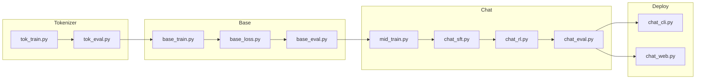

# scripts/ - Training & Evaluation

Scripts for the complete training pipeline.

## Pipeline Flow



## Scripts by Stage

### Tokenizer
| Script | Purpose |
|--------|---------|
| `tok_train.py` | Train BPE tokenizer |
| `tok_eval.py` | Evaluate compression |

### Base Model
| Script | Purpose |
|--------|---------|
| `base_train.py` | Pretrain with Chinchilla scaling |
| `base_loss.py` | Evaluate validation BPB |
| `base_eval.py` | CORE benchmark |

### Chat Model
| Script | Purpose |
|--------|---------|
| `mid_train.py` | Teach conversation tokens |
| `chat_sft.py` | Supervised fine-tuning |
| `chat_rl.py` | Reinforcement learning |
| `chat_eval.py` | Evaluate chat model |

### Deployment
| Script | Purpose |
|--------|---------|
| `chat_cli.py` | CLI chat interface |
| `chat_web.py` | FastAPI web server |

## Usage

```bash
# Pretrain (8 GPUs)
torchrun --nproc_per_node=8 scripts/base_train.py

# Web server
python scripts/chat_web.py --checkpoint path/to/model
```
