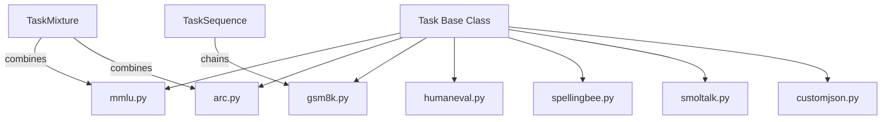

# tasks/ - Evaluation Tasks

Task implementations for training and evaluation.

## Task Hierarchy



## Available Tasks

| Task | File | Type |
|------|------|------|
| MMLU | `mmlu.py` | 57-subject MCQ |
| ARC | `arc.py` | Reasoning MCQ |
| GSM8K | `gsm8k.py` | Math generation |
| HumanEval | `humaneval.py` | Code generation |
| SpellingBee | `spellingbee.py` | Counting |
| SmolTalk | `smoltalk.py` | Conversation |
| CustomJSON | `customjson.py` | User-defined |

## Task Utilities

| Class | Purpose |
|-------|---------|
| `Task` | Base class with slicing |
| `TaskMixture` | Mix tasks with oversampling |
| `TaskSequence` | Sequential training |
| `render_mc()` | Format MCQ |

## Usage

```python
from tasks.mmlu import MMLU
from tasks.common import TaskMixture

mixture = TaskMixture([
    (MMLU(), 1.0),
    (ARC(), 2.0),  # 2x oversample
])
```
