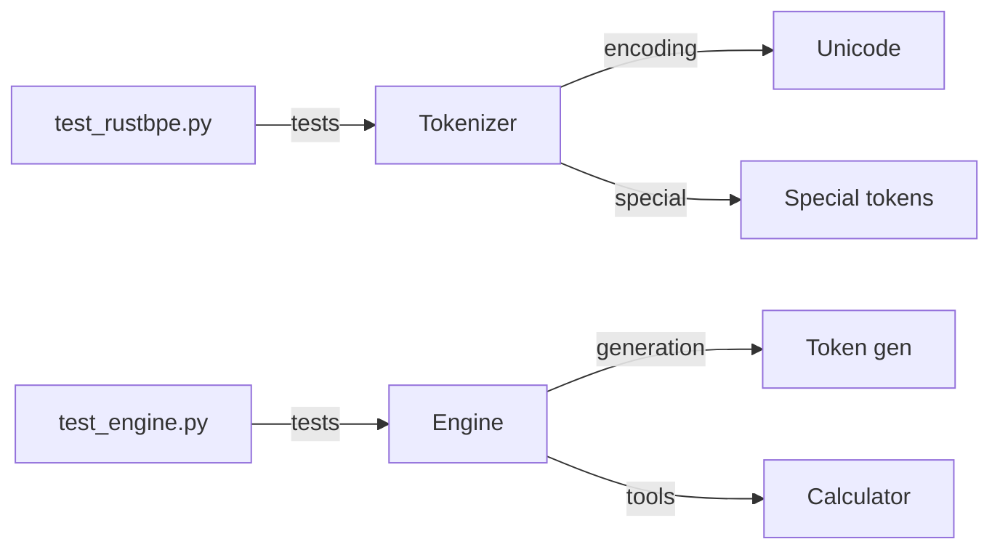

# tests/ - Unit Tests

Test suite for core components.

## Test Coverage



## Test Files

| File | Coverage |
|------|----------|
| `test_rustbpe.py` | Tokenizer edge cases, encoding/decoding |
| `test_engine.py` | Generation, KV cache, tools |

## Running

```bash
# All tests
pytest tests/

# Specific file
pytest tests/test_rustbpe.py -v
```
